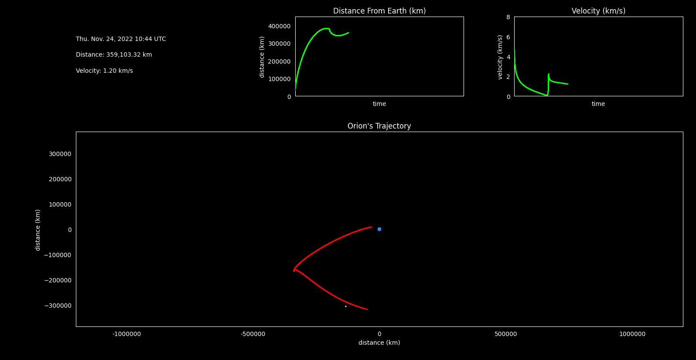

# Artemis I Trajectory Visualization
A simple Python application to animate Artemis I data using Matplotlib.

## Background and Context
[Artemis](https://www.nasa.gov/specials/artemis/) is NASA's return to the Moon. Powered by the [Space Launch System (SLS)](https://www.nasa.gov/exploration/systems/sls/fs/sls.html), the Artemis program will land humans on the moon for the first time since Apollo 17 in 1972. The first mission in the Artemis program is [Artemis I](https://www.nasa.gov/content/artemis-i-overview), an uncrewed test flight that is sending the [Orion space capsule](https://www.nasa.gov/exploration/systems/orion/about/index.html) into Lunar orbit. 

The Artemis program's unique goals require a unique orbit: a [near-rectilinear halo orbit (NRHO)](https://www.nasa.gov/feature/a-lunar-orbit-that-s-just-right-for-the-international-gateway). The unique NRHO was the inspiration for this visualization project.

## Visualizing Artemis I
Ahead of the Artemis I launch, NASA made the [pre-computed Orion ephemeris](https://www.nasa.gov/feature/track-nasa-s-artemis-i-mission-in-real-time) publicly available for download. Using this data, I plotted Orion's journey from the Earth to Moon throughout the entirety of the planned mission. The orbit is animated in 2D looking down at Earth's equatorial plane from above. Animated distance over time and velocity over time plots are also included.

## Dependencies
[**pandas**](https://pandas.pydata.org/) is used to read the Orion ephemeris as well as to read/write pre-computed Moon coordinates.

[**Skyfield**](https://rhodesmill.org/skyfield/) is used to generated the Moon's Cartesian coordinates at particular points in time.

[**Matplotlib**](https://matplotlib.org/) is used to plot and animate the data.

## Other Notes
### `generate_moon_coords.py`
To decrease loading times, the positions of the Moon in every frame of the animation has been pre-computed using the `generate_moon_coords.py` script. This script uses Skyfield to find the Cartesian coordinates of the Moon for every time value in the Orion ephemeris.

### Removing Data
For performance reasons, every *n*th row in the original Orion data file provided from NASA gets removed at runtime. The value of *n* is set by the `DIVIDE_BY` constant in `constants.py`. The smaller this number, the more values are removed from the data. Given the large amount of data points included in NASA's original file, removing every *n*th row is hardly noticeable for sufficiently large values of *n* in terms of accuracy, but it does have a very noticeable positive impact on performance.
